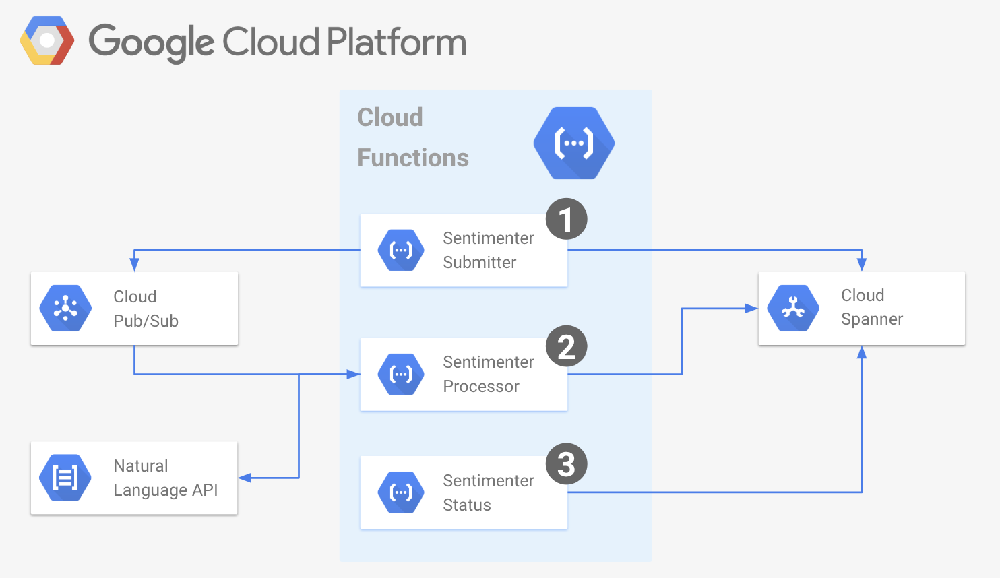

# sentimenter

Example of multi-step process leveraging GCF and multiple back-end services:

* [Cloud Spanner](https://cloud.google.com/spanner/) - horizontally scalable, strongly consistent, relational database service
* [Pub/Sub](https://cloud.google.com/pubsub/) - Ingest event streams at any scale from anywhere for real-time streaming
* [Cloud Natural Language API](https://cloud.google.com/natural-language/) - Derive insights from unstructured text using Google ML
* [Stackdriver](https://cloud.google.com/stackdriver/) - Monitoring and management for services, containers, applications, and infrastructure

The `sentimenter` solutions allows the user to query for public sentiment from the last `100` tweets for any submitted term.



## Usage

### 1. Term Submission

The `submitter` function which the user can invoke over HTTPS with their search `term` will create a `job`, save it with `Received` state in Spanner DB, and queue that job for processing in Pub/Sub topic.

```shell
HTTPS_TRIGGER_URL=$(gcloud alpha functions describe sentimenter-submitter \
    --format='value(httpsTrigger.url)')
curl "${HTTPS_TRIGGER_URL}?term=serverless"
```

Returns

```json
{
  "id": "d50ff5b2-2120-4587-a99e-c4aea5c3f592",
  "created_on": "2018-08-16T14:52:20.195459344Z",
  "search_term": "serverless",
  "status": "Received",
  "result": null
}
```

### 2. Job Processing (Background)

The `processor` function will be automatically triggered by GCF when a new job arrives on Pub/Sub topic. The processor will change the state of that `job` to `Processing`, retrieve tweets using Twitter API, and score each tweet's sentiment using Google's Natural Language API. When done, the score of that job will be saved in the Spanner DB and the job status will be updated to `Processed`.


### 3. Job Status

Throughout the entire process, the user can invoke the `status` function over HTTPS and get the current state of the submitted job. If the job status is `Processed`, the status of the job will also include its score.

```shell
HTTPS_TRIGGER_URL=$(gcloud alpha functions describe sentimenter-status \
    --format='value(httpsTrigger.url)')
curl "${HTTPS_TRIGGER_URL}?id=c24774a1-89df-4ec0-a962-121a36d6966c"
```

Result

```json
{
  "id": "6c211819-30ef-4bdb-a723-a5be4979c101",
  "created_on": "2018-08-16T14:54:02.822679302Z",
  "search_term": "serverless",
  "status": "Processed",
  "status_url": "https://us-central1-s9-demo.cloudfunctions.net/sentimenter-status?id=6c211819-30ef-4bdb-a723-a5be4979c101",
  "result": {
    "processed_on": "2018-08-16T14:54:06.636848268Z",
    "tweets": 100,
    "positive": 9,
    "negative": 0,
    "score": 13.880000105127692
  }
}
```

> Note, while the positive or negative classification of each tweet is reliable, the overall score of the sentiment for all tweets is derived by combining sentiment with the magnitude of each tweet which tends to favour longer tweets. As a result, the score is only a relative indicator of the overall strength of the sentiment and probably meaningless in itself.


## Setup

### PubSub Topic

```shell
gcloud beta pubsub topics create "sentimenter"
```

Returns

```shell
Created topic [projects/s9-demo/topics/sentimenter]
```

### Spanner DB

First create a **Spanner instance**

```shell
gcloud beta spanner instances create "sentimenter" \
  --config=regional-us-central1 \
  --description="Sentimenter DB" \
  --nodes=1
```

Returns

```shell
Creating instance...done.
```

Than create the **database** in the previously created Spanner instance

```shell
gcloud spanner databases create "db" --instance="sentimenter"
```

Returns

```shell
Creating database...done.
```

Finally create the two tables to support the `sentimenter` solution

```shell
gcloud spanner databases ddl update "db" --instance="sentimenter" \
    --ddl='CREATE TABLE jobs (id STRING(MAX), search_term STRING(MAX), created_on TIMESTAMP, status STRING(MAX)) PRIMARY KEY (id)'

gcloud spanner databases ddl update "db" --instance="sentimenter" \
    --ddl='CREATE TABLE results (id STRING(MAX), processed_on TIMESTAMP, tweets INT64, positive INT64, negative INT64, score FLOAT64) PRIMARY KEY (id)'
```

Returns

```shell
Updating database... done.
```

### Functions

First define the necessary envirnment variables

```shell
ENV_VARS="TOPIC_NAME=sentimenter"
ENV_VARS="${ENV_VARS},DB_PATH=projects/s9-demo/instances/sentimenter/databases/db"
ENV_VARS="${ENV_VARS},T_CONSUMER_KEY=${T_CONSUMER_KEY},T_CONSUMER_SECRET=${T_CONSUMER_SECRET}"
ENV_VARS="${ENV_VARS},T_ACCESS_TOKEN=${T_ACCESS_TOKEN},T_ACCESS_SECRET=${T_ACCESS_SECRET}"
```

> Note, I'm obfuscating the Twitter API variables by pulling them form my local variables.
> You can just type these keys here if you need to. See [this instructions](https://developer.twitter.com/en/docs/basics/authentication/guides/access-tokens.html)
> on how to create Twitter API credentials see

Then deploy the three functions using the GCP `gcloud` command.

```shell
gcloud alpha functions deploy sentimenter-submitter \
  --entry-point SubmitFunction \
  --set-env-vars $ENV_VARS \
  --memory 128MB \
  --region us-central1 \
  --runtime go111 \
  --trigger-http

gcloud alpha functions deploy sentimenter-status \
  --entry-point StatusFunction \
  --set-env-vars $ENV_VARS \
  --memory 128MB \
  --region us-central1 \
  --runtime go111 \
  --trigger-http

gcloud alpha functions deploy sentimenter-processor \
  --entry-point ProcessorFunction \
  --set-env-vars $PROCESS_ENV_VARS \
  --memory 256MB \
  --region us-central1 \
  --runtime go111 \
  --trigger-topic=sentimenter \
  --timeout=540s
```

If everything goes well, you should see this kind of response to every one of these above functions

```shell
Deploying function (may take a while - up to 2 minutes)...done.
availableMemoryMb: 128
entryPoint: StatusFunction
environmentVariables:
  DB_PATH: projects/s9-demo/instances/sentimenter/databases/db
  TOPIC_NAME: sentimenter
httpsTrigger:
  url: https://us-central1-s9-demo.cloudfunctions.net/sentimenter-status
labels:
  deployment-tool: cli-gcloud
name: projects/s9-demo/locations/us-central1/functions/sentimenter-status
runtime: go111
serviceAccountEmail: s9-demo@appspot.gserviceaccount.com
sourceUploadUrl: ...
status: ACTIVE
timeout: 60s
updateTime: '2018-08-16T00:38:33Z'
versionId: '4'
```

